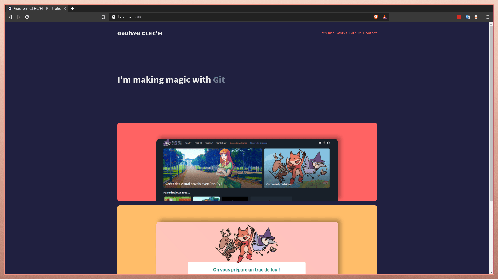

Actuellement à la recherche d'une alternance comme développeur Front End en contrat de professionnalisation, j'ai décidé de refaire mon site professionnel et notamment de suivre un conseil que l'on m'a plusieurs fois donné : ajouter un blog !

Premièrement, il m'a fallut choisir la technologie que j'utiliserais, ce qui fut plutôt rapide car la dernière version de mon site était faite avec [Gridsome](https://gridsome.org/) et que ce Framework VueJS correspond toujours à mes besoins. Il m'a permis de développer rapidement une application web progressive, complètement statique, de construire les pages "Folios" et "Articles de blog" à partir de fichier Markdown et de templates VueJS, le tout avec de bonnes performances et toutes les dépendances NodeJS dont j'avais besoin. Le Framework est cependant loin d'être parfait, nous l'utilisons actuellement avec [Erika](https://github.com/Princesseuh) pour développer [FaireDesJeux.fr](https://goulven-clech.dev/work/fairedesjeux/) et nous commencons à en voir clairement les limites, mais cela sera doute l'objet d'un autre article !

Du côté des autres technologies VueJS qui m'ont fait de l'oeil : [NuxtJS](https://fr.nuxtjs.org/), surtout depuis l'update "Content", était un choix viable mais qui aurait nécessité beaucoup plus de temps et n'aurait au final pas apporté grand chose par rapport à Gridsome pour un site aussi modeste que le mien ;  [VitePress](https://github.com/vuejs/vitepress) m'a également beaucoup intéressé ces derniers temps, mais le projet n'est pour l'instant qu'un embryon et chaque nouvelle update peut briser des features ou des syntaxes précédentes. Néanmoins, j'espère pouvoir très prochainement utiliser ces deux technologies dans d'autres projets.

Deuxièmement, j'ai dû réaliser le design. Pour cela je suis parti de mon design précédent (que vous pouvez admirer ci-dessous), en récupérant notamment les cartes qui présentent mes travaux et l'animation avec mes compétences, que j'aimais beaucoup. Mais j'ai surtout noté les différentes choses qui ne me plaisaient pas : les proportions (tout est trop gros et trop vide), les couleurs et le manque de personnalité.

J'ai donc redesigné le site rapidement sur Krita et Figma, avant de commencer à le développer en utilisant notamment Tailwind et PostCSS pour gagner du temps. Tout de suite, réduire la taille des polices et retirer les gros espaces vides à donner un aspect plus professionnel au site, j'ai simplement utilisé plusieurs couleurs de fond pour mieux distinguer les sections.

Pour les couleurs, je me suis directement inspiré de [Horizon](https://horizontheme.netlify.app/), un thème VS Code que j'apprécie énormément et sur lequel j'ai basé le thème de mon OS (vous pouvez trouver [mes Dotfiles](https://github.com/GoulvenC/dotfiles) ici). Ainsi, mon site porte les mêmes couleurs que mon environnement de travail, ce qui me permet de vraiment me sentir chez-moi !

Bonus : le site dispose de jolis animations de transition entre les pages, mais cela m'a demandé de bien ajouter les propriétés CSS dans la configuration de PurgeCSS. En effet, cette extension inclue dans Tailwind est très pratique pour ne conserver en production que le CSS réellement utilisé dans le site, mais ne sait pas fonctionner avec VueJS et ne reconnait par défaut que les propriétés CSS se trouvant dans les balises `<style>` ou dans le HTML. Un autre exemple du côté des cartes pour mon folio, où la couleur de fond est écrite par JavaScript en fonction de ce qui est indiqué sur le fichier markdown de chaque élément du folio, certaines de ces couleurs de fond ne sont utilisés à aucun autre endroit du site, et j'ai donc du les ajouter à la configuration PurgeCSS pour éviter qu'elles ne soient effacées.

Enfin, le site étant entièrement statique, j'ai pu rester en architecture JamStack : le code source du site est disponible publiquement sur mon [repo github](https://github.com/GoulvenC/goulven-clech.dev) et j'utilise [Netlify](https://www.netlify.com/) pour build et héberger le site gratuitement !

Voilà donc un bref résumé du développement de mon site, si vous avez des questions n'hésitez pas à rejoindre mon réseau [LinkedIn](https://www.linkedin.com/in/goulvenc/) et à m'envoyer un message. J'y répondrais avec plaisir :)
