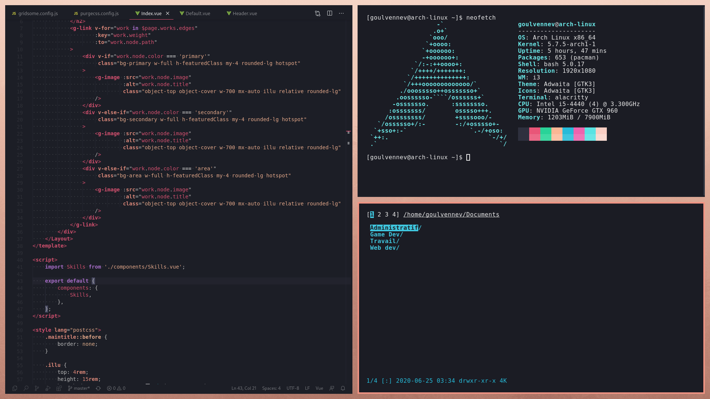

En début d'année, je me suis laissé tenté par la sortie de [Pop!_OS 20.04](https://pop.system76.com/), la distribution Ubuntu-based de System76.

Cette distribution a en effet beaucoup d'arguments pour plaire, à commencer par une des installations les plus simples et rapides disponibles, une expérience Gnome (le gestionnaire de fenêtre) plus clean par défaut que sur Ubuntu, mais avec cependant quelques ajouts bienvenues comme un système de Tiling (qui ne fonctionne pas toujours parfaitement, notamment avec les applications Gnome, mais il s'agit d'une bêta) et un store plus complet.

Néanmoins, cette distro n'en reste pas moins basée sur Debian/Ubuntu, dont certains choix technologiques douteux et les paquets souvent obsolètes (NodeJS en retard de plus d'un an !) m'imposait beaucoup de friction au quotidien. J'étais également frustré par Gnome qui est très difficile à personnaliser : la majorité des GTK Themes et des extensions n'étant pas à jour, et les faire par soi-même est inutilement complexe et demande beaucoup de maintenance. De plus, malgré des progrès, ce WM continue à avoir beaucoup de problèmes de performances et certains éléments de design sont un peu datés ou clunky (je pense notamment au tiroir d'application et aux raccourcis claviers).

Soyons clairs, je pense sincèrement que 90% des utilisateurs n'auront aucun problème avec Pop!, il s'agit d'une des meilleures distributions grand public de Linux, que je recommanderais vivement à mes proches et ma famille.

Mais pour ma part, bien décidé à me débarrasser des frictions et frustrations quotidiennes, j'ai décidé d'enfin abandonner les distributions basées sur Ubuntu et Debian. Et de redonner une chance à [Arch Linux](https://www.archlinux.org/), mais cette fois sans utiliser [Manjaro](https://manjaro.org/). Grâce à l'aide d'une amie, j'ai réussi à installer et configurer assez rapidement Arch, même si le processus est bien entendu plus complexe et chronophage que sur PopOS.

J'ai notamment eu beaucoup de mal quand, quelques jours plus tard, j'ai tenté (sans mon amie) d'installer Arch sur mon PC portable. En effet, alors que la démarche pour obtenir Internet a consisté à brancher un câble ethernet sur ma tour, j'ai été contraint d'utiliser le wifi pour connecter mon laptop mais impossible de trouver un tutoriel à jour ! Les utilitaires qu'ils recommandaient venaient d'être supprimé de l'ISO d'installation Arch il y a quelques jours, et j'ai pris quelques temps à comprendre que j'étais censé utiliser [iwctl](https://wiki.archlinux.org/index.php/Iwd). Heureusement, ce dernier est très simple d'utilisation et sa page wiki déjà très complète, je suppose que les tutoriels disponibles sur Internet vont progressivement s'y adapter.

Est-ce que toutes ces aventures valaient le coup ? Complètement.

Premièrement, il faut relativiser en précisant que cette installation, bien que plus complexe, vous permez de bien mieux comprendre ce que vous faites et comment fonctionne votre machine. Egalement, vous n'installez durant cette application que les logiciels que vous souhaitez, ce qui vous permettra d'avoir un OS aussi light que vous le voudrez, avec aucune technologie douteuse qu'une autre personne vous aurez imposé !

Deuxièmement, et c'est la raison principale de mon retour sur Arch, je redécouvre Pacman, l'AUR et [Yay](https://github.com/Jguer/yay) (l'AUR Helper que j'utilise). Il s'agit d'une expérience incomparable avec aucun autre OS (Linux, BSD, MacOS, Windows mélangés) et qui pour un développeur change complétement le quotidien : vous avez accès en une ligne de commande, à n'importe quel logiciel (gratuit) dans sa toute dernière version (ou n'importe laquelle qui vous plaira), depuis une source sûre.

Egalement, je suis tombé totalement amoureux de [i3gaps](https://github.com/Airblader/i3), qui est un gestionnaire de fenêtre à la fois minimaliste, performant, qui permet d'avoir un bureau magnifique, facilement personnalisable, ultra minimaliste, tout en boostant votre productivité grâce à des super raccourcis clavier...

J'ai passé plusieurs heures à personnaliser mon environnement, et je suis très content du résultat. La seule chose que je pense changer dans le futur proche, c'est l'absence de barre. En effet, si actuellement sur mon setup avec un écran, je préfère avoir un bureau le plus clean possible et me forcer à utiliser les raccourcis clavier, je pense installer [Polybar](https://github.com/polybar/polybar) dès que j'aurais un second écran à nouveau (et ne l'afficher que sur le premier) pour pouvoir ponctuellement naviguer plus facilement à la souris.

Pour conclure, Arch restera toujours une distribution à ne conseiller qu'aux plus nerds d'entre vous, mais qui pour moi fut une véritable bouffée d'air frais et m'a permis d'être beaucoup plus à l'aise avec mes ordinateurs ces dernières semaines. Si cela vous intéresse, n'hésitez pas à consulter [mes fichiers de configuration](https://github.com/GoulvenC/dotfiles) (dotfiles) sur Github pour vous en inspirer :)
