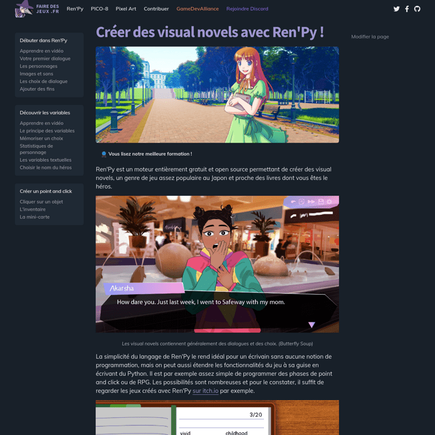

After several years of existence, we decided to transform [our wiki](https://wiki.gamedevalliance.fr) into a real participative educational website. The design was made with Figma and Krita. It will be a static PWA produced with Gridsome (a VueJS website generator) and hosted on Github.

VueJS is used here for the various interactive elements (client side) and to generate web pages from Markdown files, which are very easy to use by any contributor.

The key elements of the design are a dark theme by default, and a strong emphasis on the participative aspect of the site (links to modify a page, medal indicating the quality of training, etc.). On the technical side, this is a PWA which is therefore extremely fast, can be viewed offline, has a lazy-load system and meets modern web standards. We also used Tailwind and SASS (css frameworks), FontAwesome API, Remark and PrismJS.
